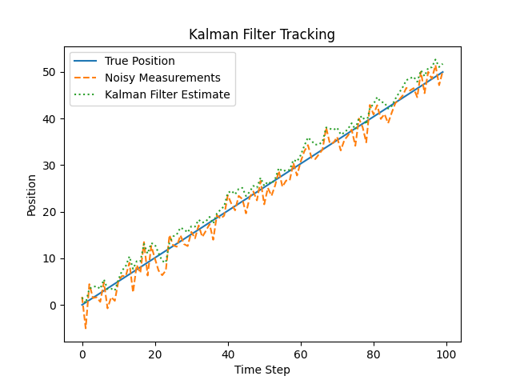

# Kalman Filter

## Overview

The **Kalman Filter** is an optimal recursive algorithm used for estimating the state of a dynamic system from a series of noisy observations. It is widely used in various fields such as robotics, navigation, control systems, signal processing, and econometrics. The filter provides estimates of unknown variables by using a mathematical model of the system's behavior, along with noisy sensor measurements.

The Kalman Filter operates in two main stages:

1. **Prediction**: The state of the system is predicted based on a model and prior state.
2. **Correction (Update)**: The prediction is corrected using new measurements or observations.

It’s particularly useful in situations where the system is subject to random noise or uncertainty.

## Key Features

* **Recursive**: The Kalman Filter updates estimates in real-time, making it ideal for real-time applications.
* **Optimal**: If the system is linear and the noise is Gaussian, the Kalman Filter produces the best (optimal) estimates.
* **Noisy Measurements**: The filter effectively handles noisy measurements from sensors or other sources.

## Algorithm Summary

The Kalman Filter is composed of two main equations: the **prediction** step and the **update** step.

1. **Prediction**:

   * The system’s state is predicted from the previous state using a system model.
   * The prediction accounts for the uncertainty in the system’s dynamics.

2. **Update**:

   * The predicted state is updated based on the current measurement.
   * The Kalman Gain is calculated to weight the predicted state and the new measurement.

The filter works by maintaining a **state estimate** and a **covariance estimate**. The state estimate represents the filter’s best guess of the system's state, while the covariance estimate quantifies the uncertainty of this estimate.

### Mathematical Representation

Let’s define the variables:

* **x\_k**: State estimate at time k
* **P\_k**: Covariance matrix representing uncertainty at time k
* **A**: State transition matrix (models how the system state evolves over time)
* **B**: Control input matrix (models control inputs to the system)
* **u\_k**: Control vector (system control inputs)
* **H**: Measurement matrix (models how the state is observed)
* **R**: Measurement noise covariance
* **Q**: Process noise covariance
* **z\_k**: Measurement at time k
* **K\_k**: Kalman Gain (determines how much to adjust the estimate)

#### Prediction Step:

1. **State Prediction**:

   $$
   \hat{x}_{k|k-1} = A \cdot \hat{x}_{k-1|k-1} + B \cdot u_k
   $$
2. **Covariance Prediction**:

   $$
   P_{k|k-1} = A \cdot P_{k-1|k-1} \cdot A^T + Q
   $$

#### Update Step:

1. **Kalman Gain Calculation**:

   $$
   K_k = \frac{P_{k|k-1} \cdot H^T}{H \cdot P_{k|k-1} \cdot H^T + R}
   $$
2. **State Update**:

   $$
   \hat{x}_{k|k} = \hat{x}_{k|k-1} + K_k \cdot (z_k - H \cdot \hat{x}_{k|k-1})
   $$
3. **Covariance Update**:

   $$
   P_{k|k} = (I - K_k \cdot H) \cdot P_{k|k-1}
   $$

### Steps Explained

1. **Prediction**: This step generates a predicted state based on the system model and prior state.
2. **Update**: This step adjusts the predicted state by incorporating new measurements (data), ensuring that the estimate remains as accurate as possible while accounting for noise.

## Applications

1. **Navigation and GPS**: Kalman Filters are used in GPS navigation systems to provide real-time estimates of a vehicle's position by combining noisy GPS data with a motion model.
2. **Robotics**: Used in robot localization and state estimation to fuse data from various sensors (e.g., accelerometers, gyros, and vision systems).
3. **Econometrics and Finance**: Used to predict financial models, stock prices, and economic indicators that evolve over time.
4. **Control Systems**: In systems where you need to estimate states, such as the temperature or pressure in a reactor.
5. **Signal Processing**: Used to filter out noise from signals, improving the quality of the data.

## Advantages

* **Optimal Estimate**: The Kalman Filter provides an optimal estimate when the system is linear and the noise is Gaussian.
* **Recursive**: Only requires the current state and observation, making it computationally efficient and well-suited for real-time applications.
* **Handles Noise**: Effective in dealing with noisy data, which is common in sensor measurements.

## Disadvantages

* **Linear Assumption**: The standard Kalman Filter assumes linearity of the system. Nonlinear systems require modifications (e.g., Extended Kalman Filter).
* **Gaussian Noise Assumption**: Assumes that both process noise and measurement noise are Gaussian, which might not hold in all cases.

## Implementation

Below is a simple Python implementation of the Kalman Filter for estimating the position of an object moving with constant velocity in `main.py`.

```python
import numpy as np
import matplotlib.pyplot as plt

# Kalman Filter Implementation
class KalmanFilter:
    def __init__(self, A, B, H, Q, R, x_0, P_0):
        # Initialize variables
        self.A = A  # State transition matrix
        self.B = B  # Control matrix
        self.H = H  # Measurement matrix
        self.Q = Q  # Process noise covariance
        self.R = R  # Measurement noise covariance
        self.x = x_0  # Initial state estimate
        self.P = P_0  # Initial covariance estimate

    def predict(self, u):
        # Predict the next state
        self.x = np.dot(self.A, self.x) + np.dot(self.B, u)
        self.P = np.dot(np.dot(self.A, self.P), self.A.T) + self.Q

    def update(self, z):
        # Kalman Gain
        K = np.dot(np.dot(self.P, self.H.T), np.linalg.inv(np.dot(np.dot(self.H, self.P), self.H.T) + self.R))
        # Update state estimate
        self.x = self.x + np.dot(K, (z - np.dot(self.H, self.x)))
        # Update covariance estimate
        self.P = self.P - np.dot(np.dot(K, self.H), self.P)

# Define system parameters
A = np.array([[1, 1], [0, 1]])  # State transition matrix (1 step prediction)
B = np.array([[0.5], [1]])  # Control matrix (for velocity)
H = np.array([[1, 0]])  # Measurement matrix (only position is measured)
Q = np.array([[1, 0], [0, 1]])  # Process noise covariance
R = np.array([[10]])  # Measurement noise covariance
x_0 = np.array([0, 1])  # Initial state estimate (position 0, velocity 1)
P_0 = np.eye(2)  # Initial covariance estimate

# Instantiate Kalman Filter
kf = KalmanFilter(A, B, H, Q, R, x_0, P_0)

# Simulate real-world data with noise
n_steps = 100
true_positions = np.linspace(0, 50, n_steps)
noisy_measurements = true_positions + np.random.normal(0, 2, n_steps)

# Track the Kalman filter estimate
estimates = []

# Simulate the Kalman filter tracking over time
for i in range(n_steps):
    u = np.array([1])  # Control input (constant velocity)
    kf.predict(u)
    kf.update(np.array([noisy_measurements[i]]))  # New measurement
    estimates.append(kf.x[0])  # Store the position estimate

# Plot the results
plt.plot(true_positions, label='True Position')
plt.plot(noisy_measurements, label='Noisy Measurements', linestyle='dashed')
plt.plot(estimates, label='Kalman Filter Estimate', linestyle='dotted')
plt.legend()
plt.xlabel('Time Step')
plt.ylabel('Position')
plt.title('Kalman Filter Tracking')
plt.show()
```

### Output


* The plot shows the true position, noisy measurements, and the Kalman filter's position estimates, where the Kalman Filter provides a smoother estimate compared to the noisy measurements.

## Conclusion

The Kalman Filter is a powerful tool for recursive state estimation, particularly in systems with noisy observations. It provides optimal estimates for linear systems and is widely used in applications like navigation, robotics, and signal processing. Despite its assumptions, its real-time, computational efficiency, and ability to handle noise make it invaluable in many practical scenarios.
